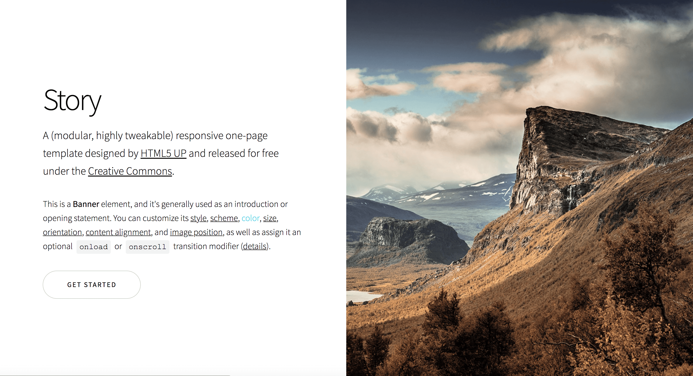
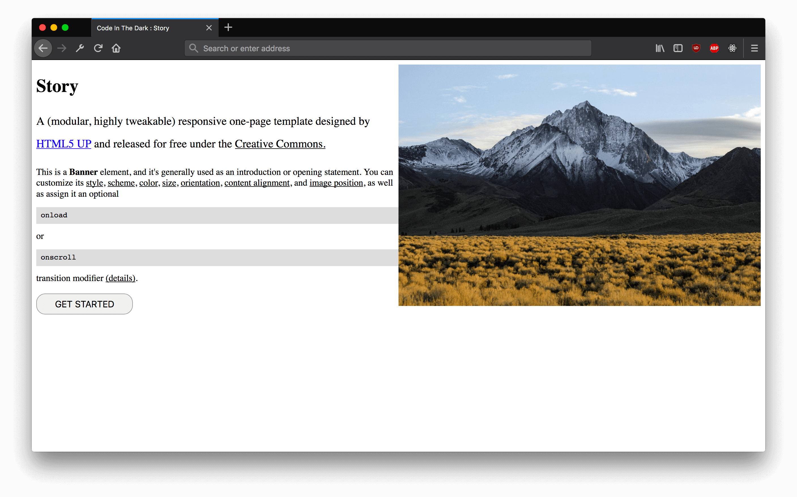
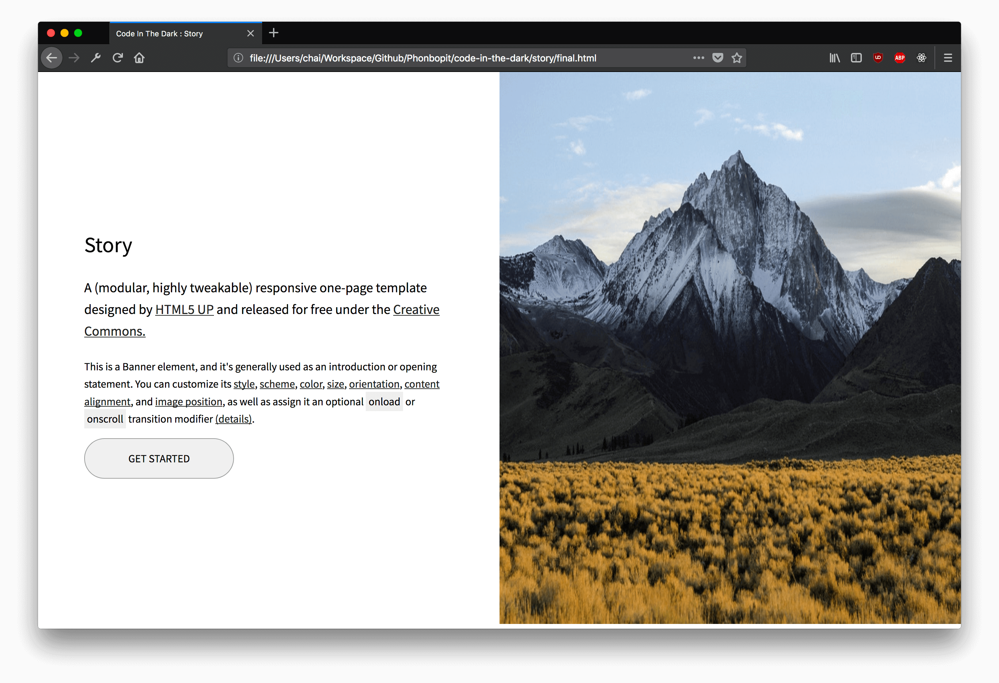

## Story

HTML Website link : https://html5up.net/story

| สิ่งที่คิด | สิ่งที่ทำ |
| --- | --- |
|  |  |

## สิ่งที่ได้รู้

* ลืมไปว่า ไม่ได้ใช้ `normalize` หรือ html reset เลยมีพวก margin อยู่ เลยใส่ `body { margin: 0 }` ไป แต่อันอื่นๆจำไม่ได้
* `.container` ไม่ได้ปรับให้ `height: 100vh` เพื่อให้ความสูงเต็มจอ
* Line : 26 : ตรงส่วน `.right img {}` ดันลืมใส่ `%` ซะงั้น
* `.content` : ไม่มี padding ด้านข้าง
* `pre` : ลืมคิดว่ามันเป็น `display: block` :) ก็เลยปรับไปใช้ `span` ดีกว่า
* ลืมปรับสีของ `a` แล้วก็ขนาด font ด้วย

## Code แก้ตัว :)

[Final](/final.html)

ด้านล่างเป็น หน้าเว็บหลังจากเห็น Result ในครั้งแรกแล้ว :) ก็เลยกลับไปปรับอีกรอบ คราวนี้มีแอบ Inspect แค่ชื่อ Font ว่าใช้ Font อะไร และก็ดาวน์โหลดมา ส่วนที่เหลือก็เหมือนเดิม Code In The Dark สุดท้ายก็ได้ผลลัพธ์ ค่อนข้างโอเค พอรับได้ แต่ก็ยังมีจุดที่ต้องปรับ เช่น ลืม `overflow` ดันมี scroll มาซะงั้น

